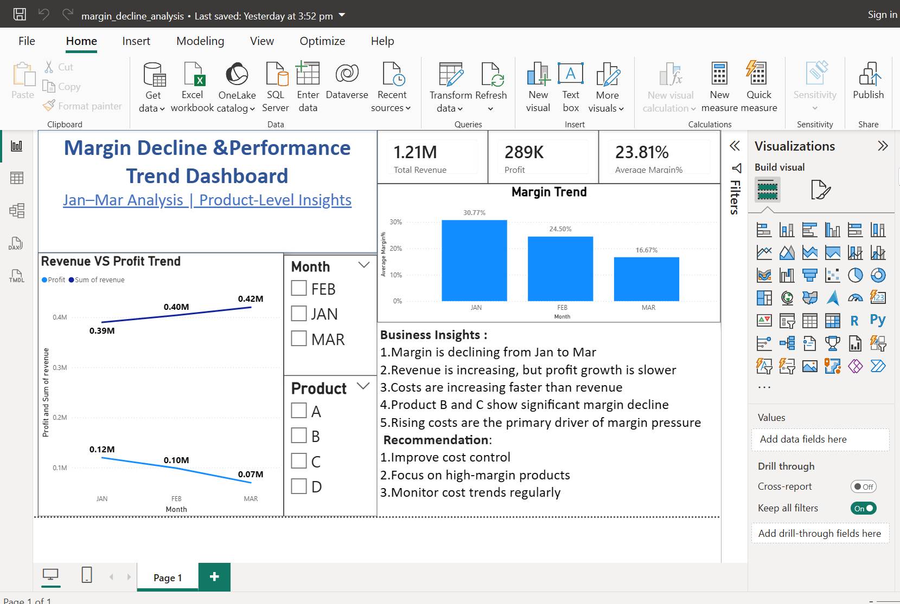

# 📊 Margin Decline & Performance Trend Dashboard (Power BI)

---

## 🔍 Objective
To analyze declining margins and identify performance trends using Power BI.

---

## 📌 Key Findings
- Margin declined from Jan to Mar
- Revenue increased, but profit growth slowed
- Costs increased faster than revenue
- Product B and C contributed to margin pressure

---

## 🧠 Analysis
This dashboard highlights the relationship between revenue growth, profitability, and margin decline across products and time periods.

---

## 🎯 Recommendations
- Improve cost control
- Focus on high-margin products
- Monitor profitability trends regularly

---

## 🛠 Tools Used
- Power BI
- Excel
- DAX

---

## 📈 Business Impact
The analysis helps identify cost-driven profitability issues and supports better financial decision-making.
